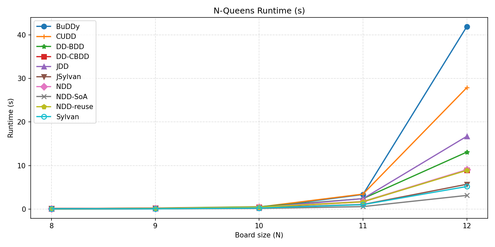
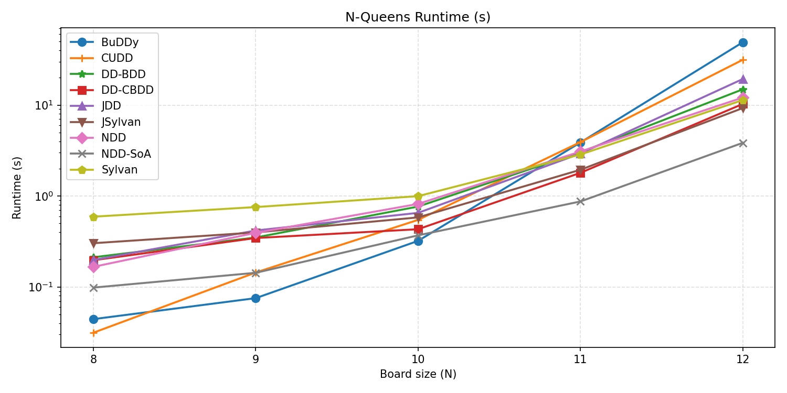
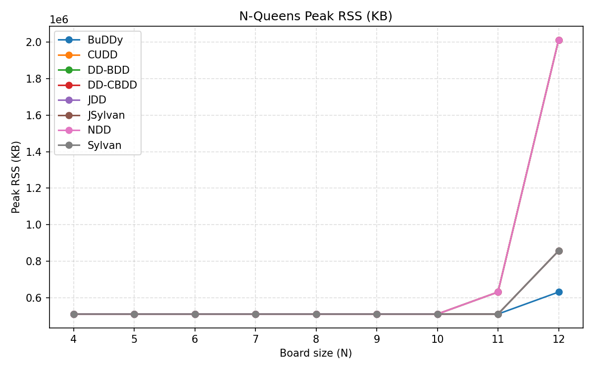
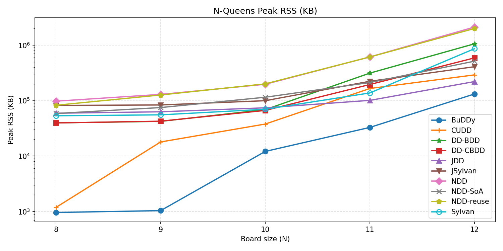
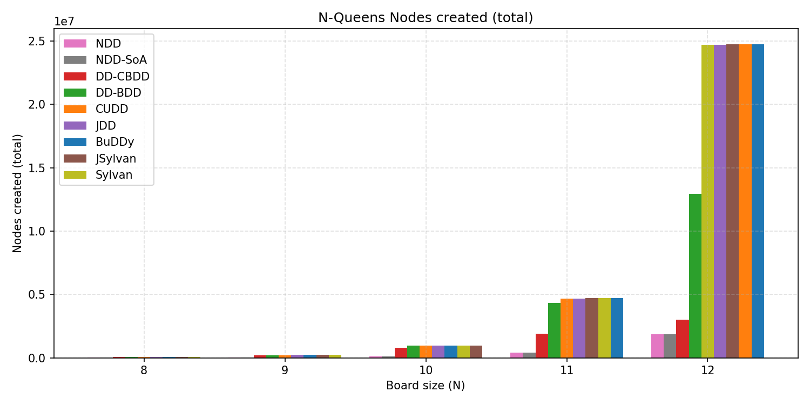
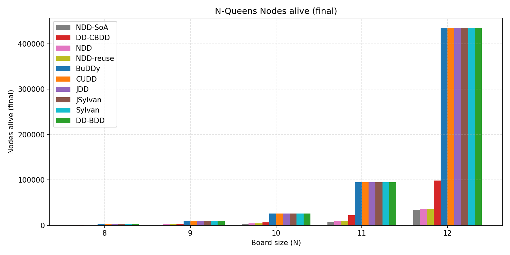

# Benchmark on all version of BDD and NDD on NQueens

> [!NOTE]
> **B**inary **D**ecision **D**iagram
> 
> - C
> 1. BuDDy
> 2. CUDD
> 3. Sylvan
> 
> - Java
> 1. jdd
> 2. JSylvan
>
> - C#
> 1. DecisionDiagrams-BDD
> 2. DecisionDiagrams-CBDD
>
> **N**etwork **D**ecision **D**iagram
> 
> - Java
> 1. NDD
> 2. NDD-reuse
> 3. NDD-SoA

## results














## How to run benchmark

### Dependency

Please install build tools(pkg-config and GMP) before run this script. Here takes Debian/Ubuntu as an example:

```bash
sudo apt update
sudo apt install build-essential pkg-config libgmp-dev openjdk-17-jdk python3 python3-pip
```

Sylvan/JSylvan will build failed without pkg-config or libgmp-dev.

### Steps

1. clone with submodule：
   ```bash
   git clone --recurse-submodules git@github.com:Augists/nqueensBenchmarkDDs.git
   ```
   if forget `--recurse-submodules`，run the script below after clone:
   ```bash
   git submodule update --init --recursive
   ```
2. run benchmark
   ```bash
   python3 scripts/run_nqueens_benchmarks.py
   ```
   - test N=4~12 by default, and will auto build binary if have not compiled
   - parameter: `--sizes 8 9 10` for N in NQueens; `--workers 0` let Sylvan/JSylvan auto detect the number of cpu cores(0 by default); `--targets BuDDy Sylvan NDD` for only test partial libraries(`all` by default)
   - All results will be recorded in `results/nqueens_metrics.csv`
3. plot
   ```bash
   python3 scripts/plot_nqueens_results.py --input results/nqueens_metrics.csv --output results
   ```
   which will generate `nqueens_time_sec.png`、`results/nqueens_time_sec_log.png`、`nqueens_max_rss_kb.png`、`nqueens_nodes.png` and else.
